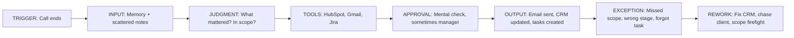

# Current Workflow Map — Post-Client Call Admin

**User:** Alex Rivera (AE / Client Delivery PM)  
**Trigger:** Client video call ends (Zoom)

---

## Workflow diagram

---

## Step-by-step (manual today)

| Step | Actor | Action | Time | Tool |
|------|-------|--------|------|------|
| 1 | Alex | Re-open Zoom, skim chat/notes | 3 min | Zoom |
| 2 | Alex | Open HubSpot, find deal, read last notes | 5 min | HubSpot |
| 3 | Alex | Open SOW PDF, mentally compare new asks | 5 min | PDF / Drive |
| 4 | Alex | Write follow-up email in Gmail | 10 min | Gmail |
| 5 | Alex | Update deal stage, next step, notes | 5 min | HubSpot |
| 6 | Alex | Create Jira tasks for delivery team | 8 min | Jira |
| 7 | Alex | Slack PM if scope concern | 3 min | Slack |
| **Total** | | | **~30–40 min** | |

---

## Exception paths (today)

| Exception | What happens | Cost |
|-----------|--------------|------|
| Out-of-scope ask missed | Team starts work unpaid; CR later | Revenue + trust |
| Wrong deal stage in CRM | Forecast wrong; manager escalates | Rework |
| Forgotten commitment | Client follow-up delayed | Relationship |
| Generic email (no context) | Client asks "did you read our last email?" | Credibility |
| HubSpot/Jira out of sync | Duplicate or missing tasks | Team confusion |

---

## Naive ChatGPT baseline (comparison)

| Step | ChatGPT today | Gap |
|------|---------------|-----|
| Paste transcript | Gets summary | No HubSpot context |
| Ask for email | Generic draft | No send integration |
| Ask for tasks | Bullet list | No Jira create |
| Scope check | Unreliable | No SOW comparison |
| CRM update | N/A | Manual copy |
| **Time** | ~15 min + still manual tool work | **Not end-to-end** |

---

## Future state (AccountFlow OS)

| Step | System | Time |
|------|--------|------|
| Record/upload | Auto transcribe | 1 min |
| Context | HubSpot pull + SOW | automatic |
| Intelligence | Draft + Scope Verifier | 1 min |
| Approve | Inbox review/edit | 3 min |
| Execute | Gmail + HubSpot + Jira | 1 min |
| **Total** | | **~6–8 min** |

---

## Pain evidence summary (for case study)

- **Frequency:** 8–12× / week
- **Time:** 30–40 min × 10 = **5–7 hrs/week**
- **Rework:** Scope misses ~20% of projects (proxy estimate)
- **Errors:** CRM lag, forgotten action items (qualitative)

Baseline measurements recorded in `docs/evaluation/BASELINE.md` (Day 1).
